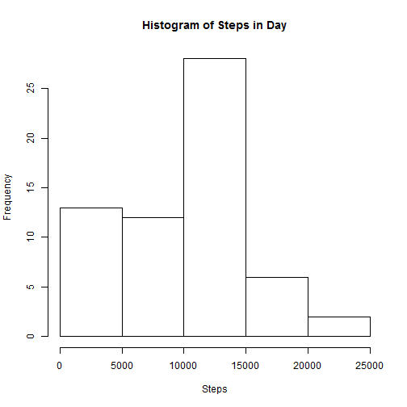
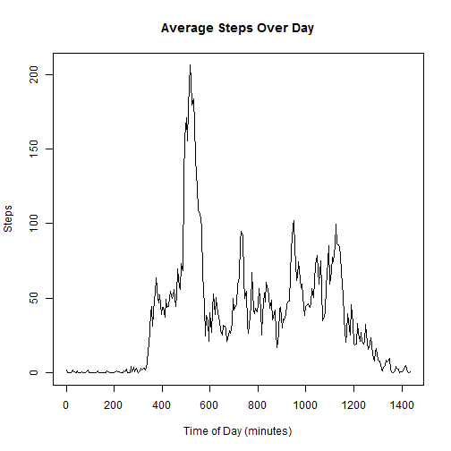
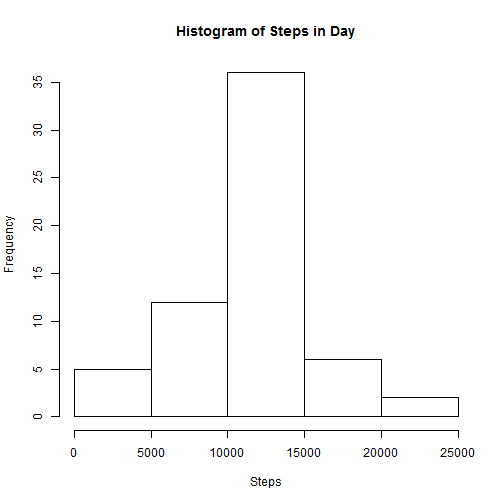
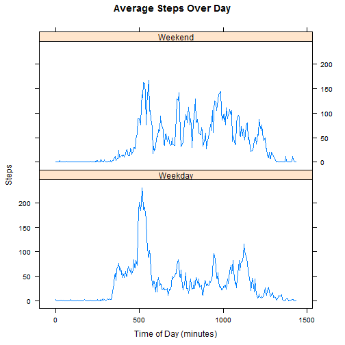

## Loading and preprocessing the data
This study's data comes from a monitoring device worn by one anonymous individual. It consists of two months of data  collected during the months of October and November, 2012 and include the number of steps taken in 5 minute intervals
each day. The data is saved in activity.csv. The files format is as follows:

1. steps: Number of steps taking in a 5-minute interval (missing values are coded as NA)
2. date: The date on which the measurement was taken in YYYY-MM-DD format
3. interval: Identifier for the 5-minute interval in which measurement was taken

Read the activity csv file into a data frame. Next convert the measurement date
vector from a factor to a date. Finaly convert the interval time measurement from hours and
minutes (HHMM) to minutes (24*60=1460 in a day).


```r
# open all libraries in markdown
library(dplyr)
library(datasets)
library(lattice)
```


```r
# read steps activity file in data frame and format
activity<-read.csv("activity.csv") 
activity$date<-as.Date(activity$date, "%Y-%m-%d") 
activity$interval<-(activity$interval%/%100)*60+(activity$interval%%100)
summary(activity)
```

```
##      steps             date               interval     
##  Min.   :  0.00   Min.   :2012-10-01   Min.   :   0.0  
##  1st Qu.:  0.00   1st Qu.:2012-10-16   1st Qu.: 358.8  
##  Median :  0.00   Median :2012-10-31   Median : 717.5  
##  Mean   : 37.38   Mean   :2012-10-31   Mean   : 717.5  
##  3rd Qu.: 12.00   3rd Qu.:2012-11-15   3rd Qu.:1076.2  
##  Max.   :806.00   Max.   :2012-11-30   Max.   :1435.0  
##  NA's   :2304
```


## What is mean total number of steps taken per day?
The sample individual's steps per day is summarized below. The st vector is the total number of steps 
per day. Its elements are indexed by activity date. N/A values are ignored. 

```r
# sum steps per day and show histogram
st<-sapply(split(activity$steps,activity$date),sum,na.rm=TRUE)
summary(st)
```

```
##    Min. 1st Qu.  Median    Mean 3rd Qu.    Max. 
##       0    6778   10400    9354   12810   21190
```

```r
hist(st,main="Histogram of Steps in Day", xlab="Steps")
```

 


```r
# compute mean and median steps by day
mn<-mean(st)
md<-median(st)
sm<-sum(st)
```

The mean number of steps per day is 9354.23 (mn) and the median is 10395 (md).


## What is the average daily activity pattern?
The sample individual's average steps over the course of a day is summarized below.

```r
# average steps per interval and plot steps by interval
st2<-sapply(split(activity$steps,activity$interval),mean,na.rm=TRUE)
plot(names(st2),st2,type="l",main="Average Steps Over Day", xlab="Time of Day (minutes)", ylab="Steps")
```

 


```r
# find the time of the maximum element of the steps vector
ms<-names(st2)[st2==max(st2)]
```

The 5-minute interval, on average across all the days in the dataset, that contains the maximum number of steps begins at 515 minutes (ms).


## Imputing missing values

```r
# find the time of the maximum element of the steps vector
nas<-sum(is.na(activity$steps))
nrw<-nrow(activity)
```

2304 (nas) of the 17568 (nrw) values are missing. Replace N/As with the average value for its 5 minute interval.

```r
# create copy of activity dataset and replace its N/As with interval mean
actnew<-activity
actnew[is.na(actnew$steps),1]<-st2[as.character(actnew[is.na(actnew$steps),3])]
summary(actnew)
```

```
##      steps             date               interval     
##  Min.   :  0.00   Min.   :2012-10-01   Min.   :   0.0  
##  1st Qu.:  0.00   1st Qu.:2012-10-16   1st Qu.: 358.8  
##  Median :  0.00   Median :2012-10-31   Median : 717.5  
##  Mean   : 37.38   Mean   :2012-10-31   Mean   : 717.5  
##  3rd Qu.: 27.00   3rd Qu.:2012-11-15   3rd Qu.:1076.2  
##  Max.   :806.00   Max.   :2012-11-30   Max.   :1435.0
```

The sample individuals steps per day from the imputed dataset is summarized below. The sti vector is the total number of steps 
per day. Its elements are indexed by activity date.

```r
# sum steps per day and show histogram
sti<-sapply(split(actnew$steps,actnew$date),sum,na.rm=TRUE)
summary(sti)
```

```
##    Min. 1st Qu.  Median    Mean 3rd Qu.    Max. 
##      41    9819   10770   10770   12810   21190
```

```r
hist(sti,main="Histogram of Steps in Day", xlab="Steps")
```

 


```r
# compute mean and median steps by day
mni<-mean(sti)
mdi<-median(sti)
smi<-sum(sti)
```

The mean and median of the imputed dataset increased and converged. The mean number of steps per day is 10766.19 (mni) and the median is 10766 (mdi). The total number of steps increased from 570608 (sm) to 656738 (smi).


## Are there differences in activity patterns between weekdays and weekends?
Create a new factor vector that indicates weekend or weekday and bind it to the imputed dataset. Use this to create a panel plot
that contrasts number of steps on a weekday to a weekend day.


```r
# compare weekend vs weekday steps over day 
actnew$weekend<-(weekdays(actnew$date)=="Saturday" | weekdays(actnew$date)=="Sunday")
actnew$weekend<- factor(actnew$weekend, labels = c("Weekday", "Weekend"))
grp <- group_by(actnew, interval, weekend)
smr <- summarise(grp, mean(steps))
names(smr)[3] = "steps"
xyplot(steps ~ interval | weekend, data = smr, type="l", layout = c(1, 2), main="Average Steps Over Day", xlab="Time of Day (minutes)", ylab="Steps")
```

 
